# Лабораторная работа №1

## 1. Определения

- *Исполняемый файл* (исполняемый код) — файл, содержащий программу в виде набора элементарных инструкций, которая после загрузки в память может быть выполнена на определенном физическом устройстве (процессоре) под управлением опредленной операционной системы.
- *Ассемблер* — язык программирования низкого уровня, в котором каждая инструкция физического устройства представлена в текстовом виде.
- Программа написанная на языке высокого уровня называется
*исходным кодом*.
- *Виртуальная машина* — это средство описания семантики языка
программирования.
- *Стандарт языка программирования* — документ, описывающий язык программирования максимально подробно и, по возможности, наиболее формально.
- *Транслятор* — техническое средство, осуществляющее перевод текста программы с одного языка на другой. Изначально выделялись следующие виды трансляторов.
	- *Компилятор*. Транслятор, переводящий программу в машинный код для последующего исполнения (С++).
	- *Интерпретатор*. Транслятор, читающий и исполняющий программу по одной команде (Lisp).
	- *Псевдокомпилятор* — транслятор, переводящий программу в промежуточное представление (байт-код), который состоит из набора инструкций близких по смыслу к машинному коду*
	- *Компилирующий интрепретатор* — транслятор, переводящий текст программы во внутреннем представление непосредственно после запуска. В процессе работы программа интерпретируется уже в этом представление (Python).
	- *REPL-интерпретатор*. Программное средство, работающее в цикле чтения-вычисления-печати (Read-Eval-Print Loop). Интерпретатор в режиме диалога считывает законченную конструкцию языка, транслирует ее, исполняет и выводит результат (IDLE shell Python).
- *Единица трансляции* — минимальный фрагмент программы, который может быть транслирован независимо от остального кода.
- *Препроцессинг* (предобработка) — начальный этап трансляции программы.
- *Сборка* — заключительный этап трансляции, результатом которого является исполняемый файл.
## 2. Скриншот с трансляцией программы

- *Tab*- Переключить фокус между левой и правой панелями.
- *Alt + F1* - Открыть список дисков для левой панели.
- *Alt + F2* - Открыть список дисков для правой панели.
- *Ctrl + U* - Поменять панели местами.
- *Ctrl + O* - Открыть командную строку.
- *Alt + < / >* - Вернуться назад или перейти вперед по истории папок.
- *F4* - Открыть файл во встроенном текстовом редакторе.
- *F7* - Создать новую папку.
- *F8* - Удалить файлы в Корзину.
- *F2* - Сохранить изменения в файле.
- *Shift + F2* - Сохранить файл под другим именем.
- *Ctrl + Z* - Отменить последнее действие.
- *Shift + Стрелки* - Выделение текста.
- *Shift + F4* - Открыть или создать новый файл.


## 3. Скриншот с трансляцией программы

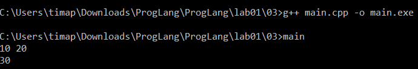

## 4. Раздельная трансляция C++

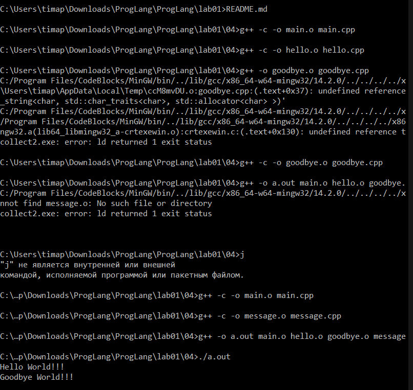

## 5. Аналогично пункту 4 на Java

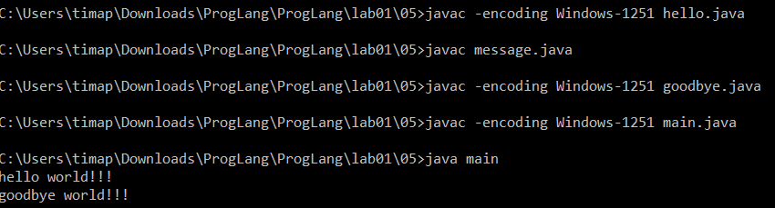

## 6. Аналогично пункту 4 на Python

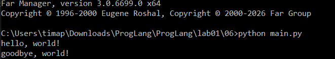

## 7. Makefile

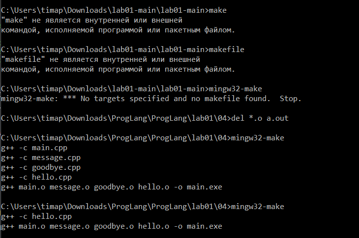

Утилита `make` автоматизирует процесс сборки, используя файл инструкций `Makefile`. Работа `make` основана на сравнении временных меток (timestamps) файлов. 

`Makefile` состоит из правил. Каждое правило имеет вид:
```Makefile
цель: зависимости
    команда
```

Когда мы запускаем `make`, утилита ищет первую цель (в нашем случае `all`, которая зависит от `app`). Чтобы собрать `app`, ей нужны объектные файлы (`main.o`, `hello.o` и т.д.). 

Для каждого объектного файла `make` проверяет: если исходный `.cpp` файл был изменен позже, чем существующий `.o` файл (или `.o` файл вообще отсутствует), `make` выполняет команду компиляции для этого файла. Если `.o` файл новее исходника, компиляция пропускается.

После того как все зависимости (`*.o`) готовы, `make` проверяет саму цель `app`. Если хотя бы один объектный файл был пересобран (или если сам файл `app` был удален), `make` выполняет команду линковки, чтобы создать новый исполняемый файл. Это называется инкрементальной сборкой и позволяет значительно экономить время при работе над большими проектами.

## 8. Сравнение стандартов C++

### 1. Использование вектора

```c++
#include <vector>
#include <iostream>
int main() {
    std::vector<int> v(5);
    for (int i=0; i<5; i++)
        std::cout << v[i] << ' ';
    return 0;
}
```

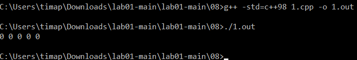

Компилируется без предупреждений во всех стандартах

### 2. Цикл по коллекции

```c++
#include <vector>
#include <iostream>
int main() {
    std::vector<int> v(5);
    for (int x : v)
        std::cout << x << ' ';
    return 0;
}
```

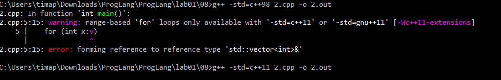

В стандартах до `c++11` выдает предупреждение, начиная с `с++11` компилируется без ошибок.

### 3. Ключевое слово auto

```c++
#include <vector>
#include <iostream>
int main() {
    std::vector<int> v(5);
    for (auto x : v)
        std::cout << x << ' ';
    return 0;
}
```

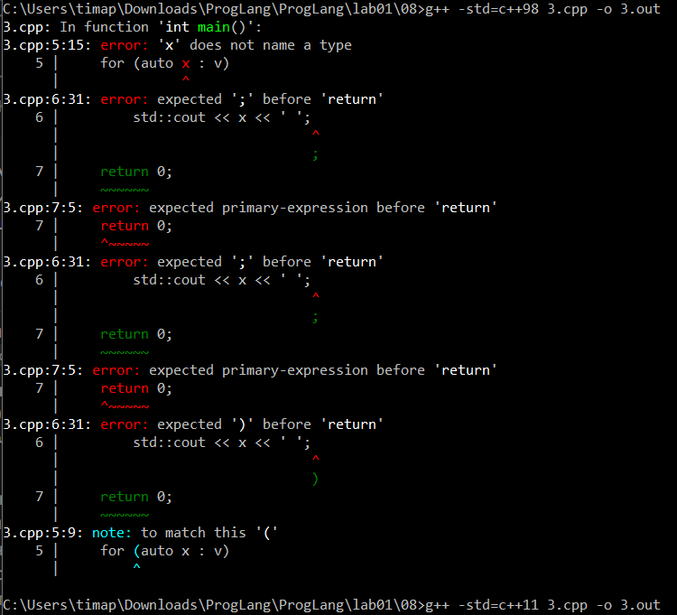
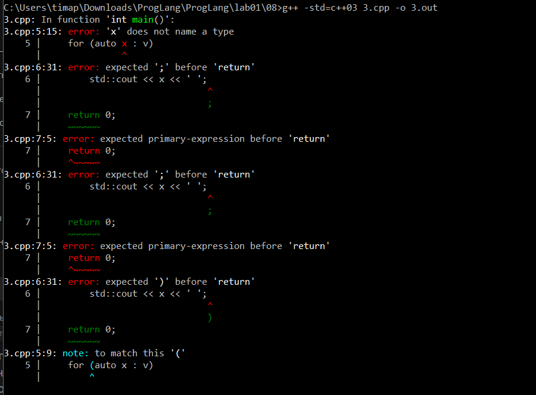

В стандартах до `c++11` выдает предупреждение, начиная с `с++11` компилируется без ошибок.

### 4. Инициализация списком

```c++
#include <vector>
#include <iostream>
int main() {
    std::vector<int> v = {1,2,3,4,5};
    for (int i=0; i<5; i++)
        std::cout << v[i] << ' ';
    return 0;
}
```

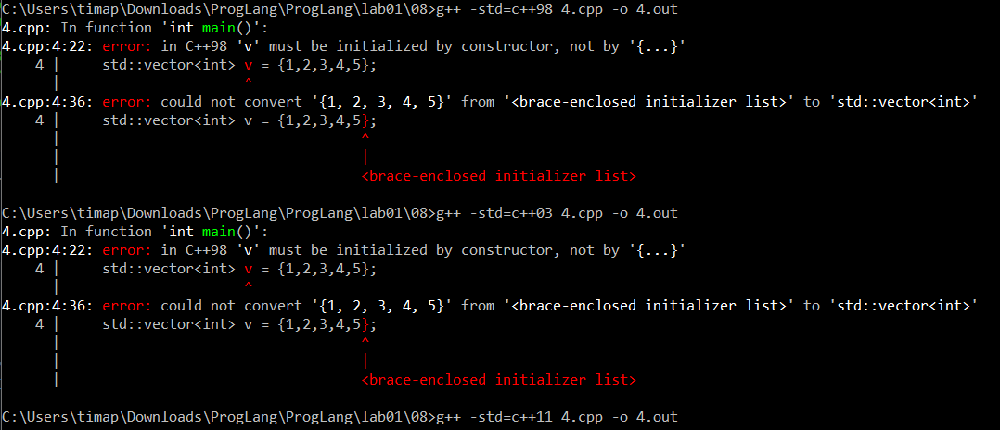

В стандартах до `c++11` выдает *ошибку*, начиная с `с++11` компилируется без ошибок.

### 5. Двоичные литералы

```c++
#include <vector>
#include <iostream>
int main() {
    std::vector<int> v = {1,2,3,4,5,0b1100};
    for (int i=0; i<5; i++)
        std::cout << v[i] << ' ';
    return 0;
}
```

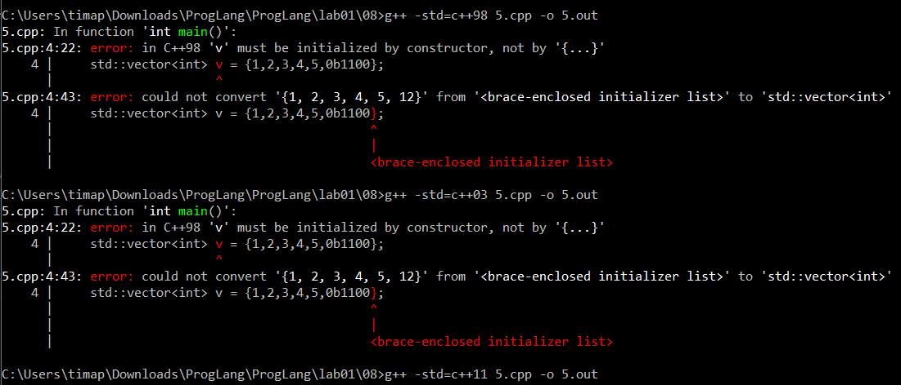

Нигде не выдает ошибки о двоичных литералах, только об инициализации списка.

### 6. Определение типа по конструктору

```c++
#include <vector>
#include <iostream>
int main() {
    std::vector v = {1,2,3,4,5};
    for (int i=0; i<5; i++)
        std::cout << v[i] << ' ';
    return 0;
}
```

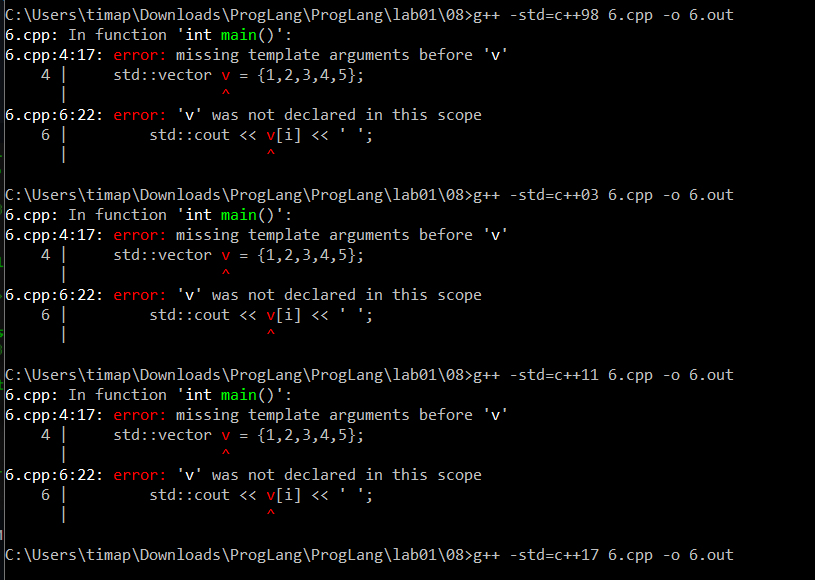

До стандарта `c++17` выдает ошибки.
